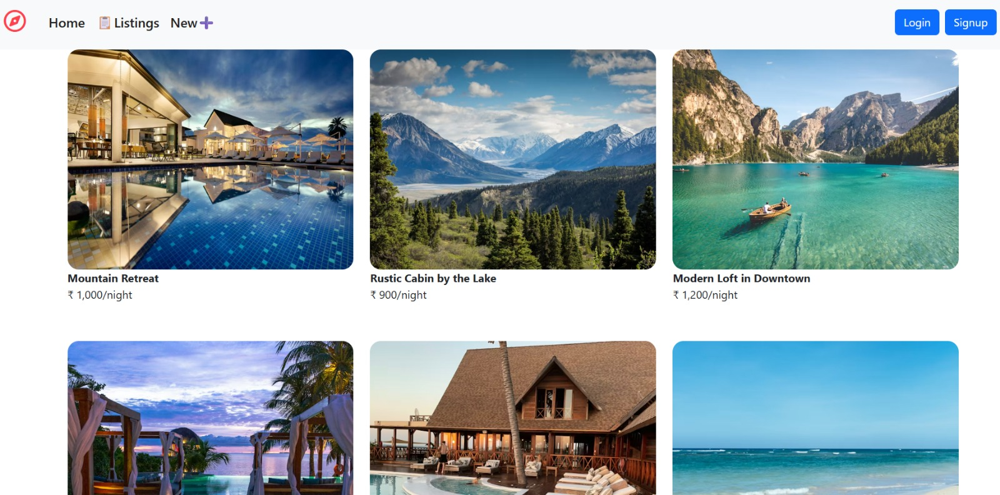

# Haven Stay 🏨

A hotel booking application built with **Node.js**, **Express**, and **EJS templates**. It provides a backend-driven solution for managing hotel reservations, user authentication, and dynamic content rendering. The project uses MongoDB for data storage and Passport.js for secure authentication.
---
## 📸 Preview


---

## ✨ Features
- 🔐 **User Authentication** – Secure login and signup with Passport.js and session management.
- 🏨 **Hotel & Room Management** – Add, update, and manage hotel listings.
- 📅 **Booking System** – Reserve rooms with real-time availability.
- 🎨 **EJS Templating** – Dynamic server-side rendering with layouts using `ejs-mate`.
- 📂 **File Uploads** – Upload images with Multer.
- ⚙️ **Validation** – Robust input validation using Joi.
- 🔄 **Method Override** – Support for PUT/DELETE in forms.
- 📢 **Flash Messages** – User-friendly alerts with `connect-flash`.

---

## 🚀 Installation

Clone the repository:
```bash
git clone https://github.com/prerna-kumari83/Haven_stay.git
cd Haven_stay
```


Visit:
```
http://localhost:3000/listings
```


---

## 📂 Project Structure
```
Haven_stay/
│── views/          # EJS templates
│── public/         # Static assets (CSS, JS, images)
│── routes/         # Express routes
│── models/         # Mongoose models
│── app.js          # Main server file
│── package.json
│── .gitignore
│── README.md
```

---

## 📦 Dependencies
- **express** – Web framework
- **ejs / ejs-mate** – Templating engine
- **mongoose** – MongoDB ODM
- **passport / passport-local / passport-local-mongoose** – Authentication
- **express-session** – Session management
- **connect-flash** – Flash messages
- **multer** – File uploads
- **joi** – Input validation
- **method-override** – HTTP method override
- **nodemon** – Development server auto-restart

---

## 🤝 Contributing
1. Fork the repo
2. Create a feature branch (`git checkout -b feature-name`)
3. Commit changes (`git commit -m "Add feature"`)
4. Push (`git push origin feature-name`)
5. Open a Pull Request

---


## 🙌 Acknowledgments
- Built with **Node.js + Express + EJS**
- Inspired by modern hotel booking platforms
- Thanks to open-source contributors and libraries
